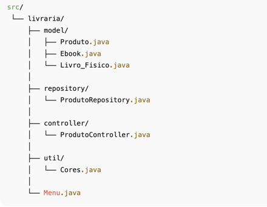
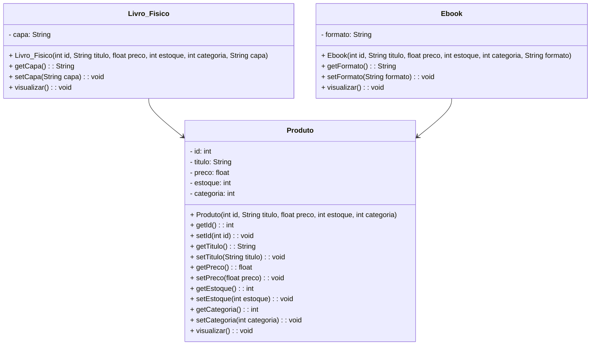
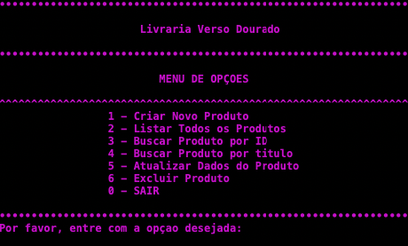

# Projeto [Livraria Verso Dourado] - Java

<br />

<div align="center">
	
</div>

<br />

<div align="center">
  
  
  
  
  
  
</div>


------

<br />

## 📚 Descrição

Para o **Projeto Final do Bloco 1** escolhi construir um sistema simples de **E-commerce para uma Livraria Online**, desenvolvido em **Java**, que oferece produtos físicos e digitais de diferentes estilos literários.

A aplicação tem como objetivo simular um ambiente de compras, permitindo o **cadastro, listagem, consultas, atualização e remoção de produtos**, além de possuir regras de retornos e gerador de ID. A estrutura foi projetada para demonstrar os conceitos aprendidos em **Programação Orientada a Objetos (POO)**, como:

- Superclasse e subclasses;
- Atributos e métodos;
- Modificadores de acesso;
- Herança e polimorfismo;
- Organização em camadas (Repository, Controller).
- Classes Abstratas;
- Interfaces.

Este projeto serve como base prática para consolidar o aprendizado da POO aplicada a um cenário realista e de fácil compreensão.

O sistema organiza as informações dos produtos disponíveis — incluindo o título do livro, o valor do produto, a quantidade em estoque, o tipo de produto, sendo físico o tipo de capa e sendo ebook o formato.

O principal objetivo é automatizar e simplificar o controle do estoque — garantindo assim a organização da loja virtual e promovendo agilidade e precisão na venda.

Além de servir como um simulador funcional, o projeto oferece uma base prática para compreender os princípios fundamentais da POO aplicados a um cenário realista.

<br />

## 🚀 Funcionalidades do Projeto

0. Encerra o programa e exibe os dados da desenvolvedora ✨ 

1. **Cadastrar Produto:** Inclui novos livros físicos e ebooks no catálogo, especificando titulo do livro, o valor final, o estoque disponível e o tipo. O número da conta é gerado automaticamente.
2. **Listar Produtos:** Mostra todos os itens cadastrados no sistema.
3. **Consultar Produto por ID ou título:** Busca um produto específico, seja pelo ID ou pelo seu título.
4. **Atualizar Produto:** Edita informações de um item já cadastrado com base no ID.
5. **Excluir Produto:** Remove um item do catálogo com base no ID e após confirmação da ação.

<br />

## 🛠️ Tecnologias Utilizadas

- **Java 17**
- **Paradigma de Programação Orientada a Objetos (POO)**
- **Collections (List, ArrayList, Stream API)**
- **Interface e Controller** para CRUD
- **Polimorfismo de sobrecarga e sobrescrita**
- **Tratamento de exceções (InputMismatchException)**

<br />

## 📂 Estrutura do Projeto

<br />

<div align="center">
   
</div>

<br />

## 📘 Diagrama de Classes

Um **Diagrama de Classes** é um modelo visual usado na programação orientada a objetos para representar a estrutura de um sistema. Ele exibe classes, atributos, métodos e os relacionamentos entre elas, como associações, heranças e dependências.

Esse diagrama ajuda a planejar e entender a arquitetura do sistema, mostrando como os componentes interagem e se conectam. É amplamente utilizado nas fases de design e documentação de projetos.

Abaixo, você confere o Diagrama de Classes do Projeto Conta Bancária:



<br />

## ✨ Slogan da Livraria

**“Livraria Verso Dourado – O brilho da leitura na sua vida!”**

<br />


## 💻  Tela Inicial do Sistema - Menu

<br />

<div align="center">
   
</div>

<br />

## 📌 Requisitos

Para executar os códigos localmente, você precisará de:

- [Java JDK 17+](https://www.oracle.com/java/technologies/javase/jdk17-archive-downloads.html)
- [Eclipse](https://eclipseide.org/) ou [STS](https://spring.io/tools)

<br />

## ❔Como Executar o projeto no Eclipse/STS

### ❗1. Importando o Projeto

Antes de tudo - Clone o repositório do Projeto [[Projeto_final_bloco_01](https://github.com/cdouradom/Projeto_final_bloco_01)]dentro da pasta do *Workspace* do Eclipse/STS

```bash
git remote add origin git@github.com:cdouradom/Projeto_final_bloco_01.git
```

2. **Abra o Eclipse/STS** e selecione a pasta do *Workspace* onde você clonou o repositório do projeto
3. No menu superior do Eclipse/STS, clique na opção: **File 🡲 Import...**
4. Na janela **Import**, selecione a opção: **General 🡲 Existing Projects into Workspace** e clique no botão **Next**
5. Na janela **Import Projects**, no item **Select root directory**, clique no botão **Browse...** e selecione a pasta do Workspace onde você clonou o repositório do projeto
6. O Eclipse/STS reconhecerá automaticamente o projeto
7. Marque o Projeto Conta Bancária no item **Projects** e clique no botão **Finish** para concluir a importação

<br />

### ❗2. Executando o projeto

1. Na guia **Package Explorer**, localize o Projeto Conta Bancária
2. Abra a **Classe Menu**
3. Clique no botão **Run**  para executar a aplicação
4. Caso seja perguntado qual é o tipo do projeto, selecione a opção **Java Application**
5. O console exibirá o menu do Projeto.

<br />

## 💬  Contribuição

Este repositório é parte de um projeto educacional, mas contribuições são sempre bem-vindas! Caso tenha sugestões, correções ou melhorias, fique à vontade para:

- Criar uma **issue**
- Enviar um **pull request**
- Compartilhar com colegas que estejam aprendendo Java!

<br />


## 👩‍💻 Autora

**Cíntia Marques Dourado**

 📧 Email: CintiaD@genstidents.org ou cdouradom@gmail.com

 🌐 GitHub: [cdouradom](https://github.com/cdouradom) Para dúvidas, sugestões ou colaborações, entre em contato via GitHub ou abra uma issue!

[🎥 Veja a demonstração do projeto](assets/Parte_03.mp4)

<br />